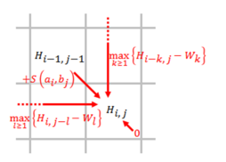
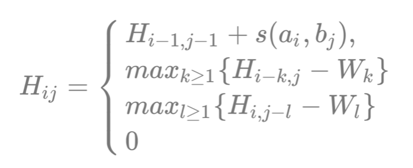
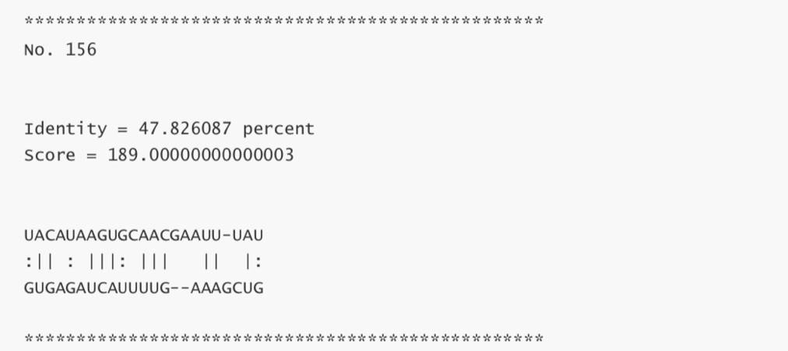
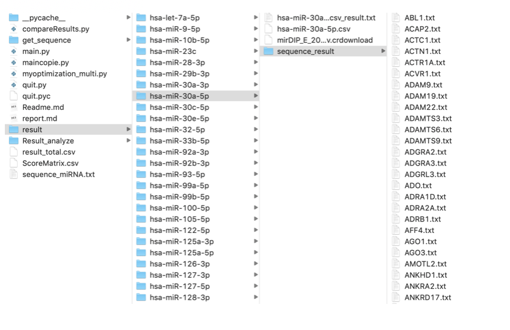

## Project Information

This project has two main parts.

#### Smith Waterman Algorithm

-  It is a modified Smith Waterman algorithm that can do sequence alignment automatically in python.

#### Introduction

- [Traditional Smith-Waterman Algorithm]([https://en.wikipedia.org/wiki/Smith%E2%80%93Waterman_algorithm](https://en.wikipedia.org/wiki/Smith–Waterman_algorithm))

It is a dynamic planning algorithms for sequence alignment.

- Modified Smith-Waterman Algorithm

 We made every two bases in the amino acid as a pair and implemented the new Scoring Matrix of 16*16

##### Output

#### Get Sequence

- It is a crawler in python and bash that can get sequence quickly on NCBI.

##### Output

